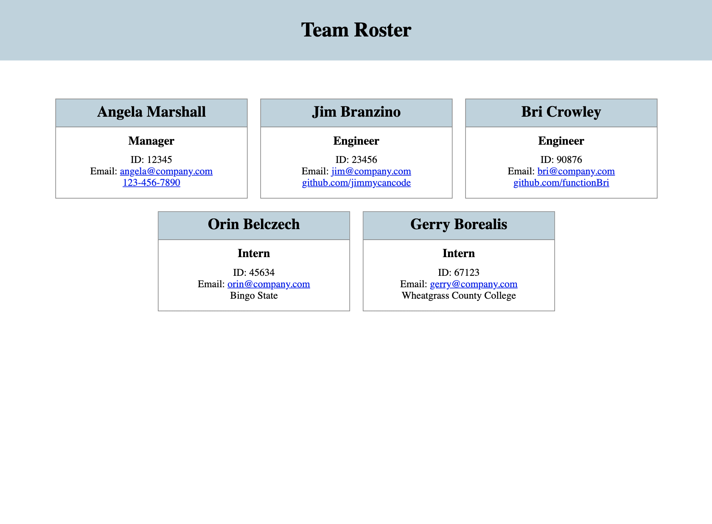

## rosterUp

- [Description](#description)
- [Installation](#installation)
- [Usage](#usage)
- [License](#license)

# Description

This is a node terminal app that allows the user to easily create a team roster page by answering a series of prompts via inquirer. The user will first enter information about the manager, after which they are presented with the options to add Engineers and/or Interns, or to Finish building the team. When the user selects "Finish", the HTML is generated and written to a new "roster.html" file in the Output directory, and linked to a "style.css" file to apply basic styling.

Because this app is solely a command line program, it is not deployed. For a demonstration of its functionality, please view the video at this link:

<a href="https://drive.google.com/file/d/1OAWtLHhL1TGfigUiNBIOvcLyh8OplV8W/view" target="_blank">App Demo Video</a>

# Installation

Clone the repo and open it in your code editor of choice and install the necessary dependencies via the termnial:

`npm i`

# Usage

Once the installations have completed, initiate the app in the terminal:

`node index.js`

Follow the prompts in the terminal, building your team as needed.

Once all prompts have been answered, a file named "roster.html" will be generated in the "output" directory. This is your team roster page! Please note, running the program again will directly overwrite it, so make sure to relocate the file if you would like to make several pages.

# License

[MIT License](https://opensource.org/licenses/MIT)
